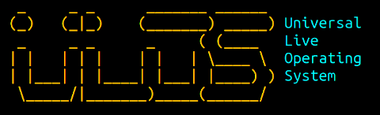

# ULOS - Debian Image



Universal Live(sport) Operating System - ULOS. Live netboot OS based on Linux Debian.

Small OS which can boot from PXE (netboot) and do some automated tasks. Tasks can be passed to os via Kernel CMDLINE.
OS boots from network, download tasks / scripts and execute them via SystemD Unit.

# Why ?
Originaly we developed this for deploying servers to production environment in Livesport. We also learn a lot from it. 
You can use it with Foreman to deploy your images or as recovery netboot system or as base start to create disk-less systems. Now it's used in our infrastructure for various maintenance tasks or tests. 

# It's Free and Open
Use it as you wish, for learning or for your tasks. We publish it under GPL v3.

# Basic Usage

## Netboot example with pxelinux

```
kernel vmlinuz
append initrd=initrd.img boot=live root=http://myaddress/debian-buster.img root_pass=DebuOnly1 
```

Please for security reasons `root_pass=` use only for debugging. In production systems use ssh keys instead.

## System parameters


Kernel basic params
-------------------

This image support few kernel parameters to handle some basics around access and authorization
and automatic job execution.

* `boot=`, if you want to boot live image use `boot=live`
* `root=`, when using `boot=live` you can provide image address as root parameter. System automatically configure networking and download root image using wget

Initrd image support DNS resolution so it's not a problem to use DNS names instead of IPs.

System Access parameters
------------------------

* `root_pass=`, sets root password. By default there is no root password and there is not reason for that. However for debug purposes you can use this parameter to set some debug password. I encourage you to use sshkeys instead of passwords.
* `sshkey_src=`, address with authorized_keys to retrieve for root and debian user. This keys will be applied to root user and to debian user (standard user with sudo)

Automatic Job execution
-----------------------
All these tasks are executed from `ulos-executor.service` by `systemd` after startup

* `run_task=`, address where system download script and execute it as main task
* `before_task=`, address where to get script which will be executed before run_task. If before_task fails, system don't execute the run_task.

## Utilities preinstalled in image

Look into `Makefile` for `env_packages=` variable 


